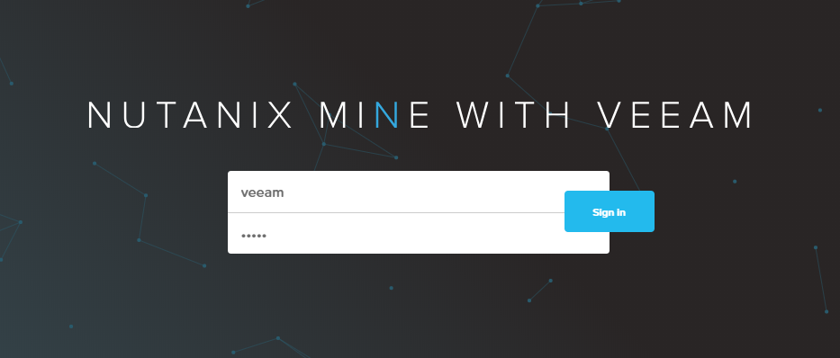
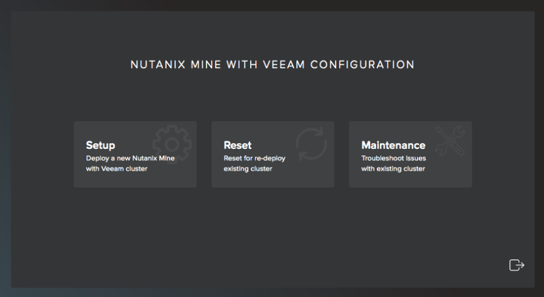
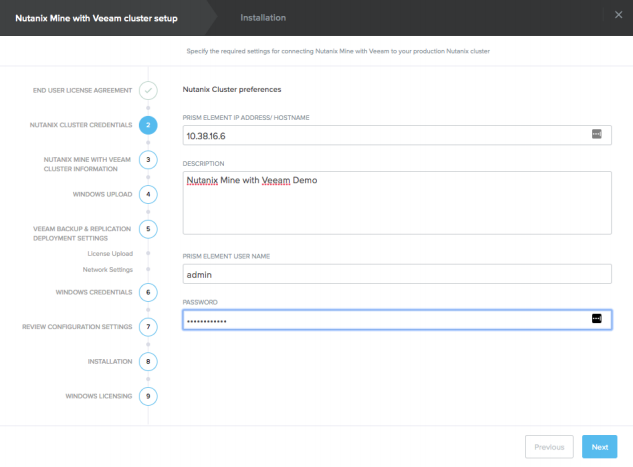
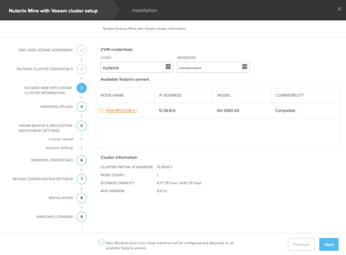
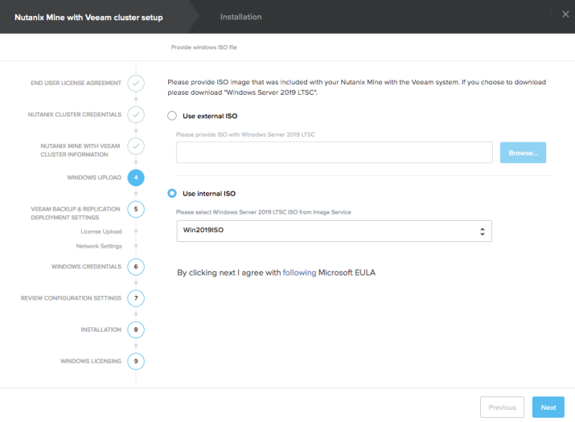
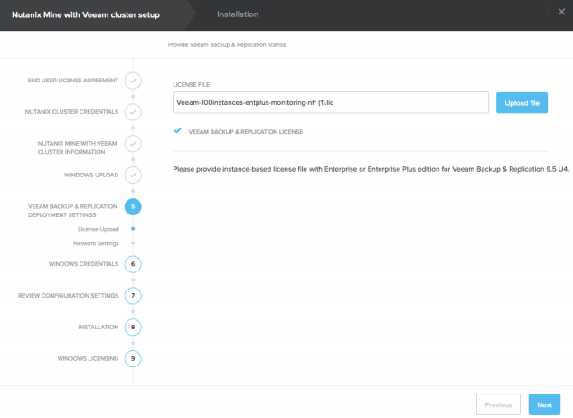
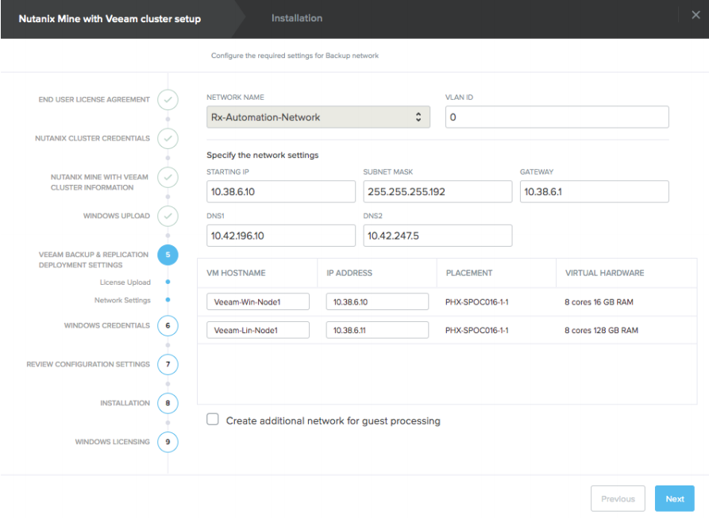
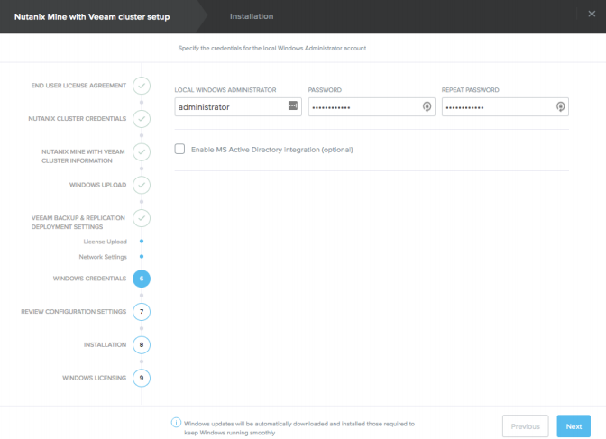
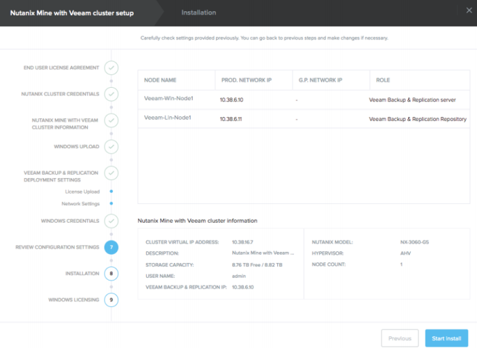

.. _mine:

----------------------
Nutanix Mine for Veeam
----------------------

*The estimated time to complete this lab is 60 minutes.*

Overview
++++++++

This guide outlines how to deploy Mine with Veeam to an NX-cluster (including single-nodes) for demo purposes. This document should not be distributed and is for education and enablement purposes only. The changes to the respective configurations to allow single-node support are not supported production configurations.

Deploying Mine with Veeam on a Demo Cluster
+++++++++++++++++++++++++++++++++++++++++++

#. Navigate to static IP set within a browser https://[IP]:8743

#. Login with veeam veeam then choose “Setup”

#. Accept all licenses then click Next
#. Enter Prism Element IP address

#. Enter CVM credentials (nutanix and CVM password)

#. Either upload the Windows ISO image using the Browse or use an image already uploaded to the cluster

#. Upload the license file from http://10.42.194.11/images/Veeam/Mine/Veeam-100instances-entplus-monitoring-nfr.lic

#. Specify IP address schema

#. Specify User name and password for the Veeam VBR Windows Server

#. Confirm the details look correct, then click “Start Install” 

#. After the deployment finishes (~2 hours) you’ll have the option to license the Windows components you can ignore this step for a demo/non-prod environment
#. You can now configure sources to backup within the Veeam B&R console. Note that if you wish to backup AHV workloads, you’ll need to deploy a Veeam Availability for Nutanix (VAN) appliance to each AHV cluster you wish to backup VMs from. Once that appliance is deployed, you configure all backup jobs and schedules for AHV from it (rather than the VBR).

